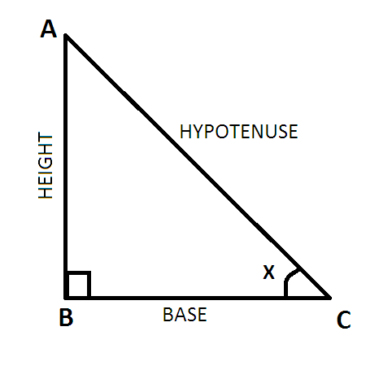

# Height-Measurer
Measure the height of real-world things using your phone and triangulation

## What is Triangulation?
In trigonometry and geometry, triangulation is the process of determining the location of a point by forming triangles to the point from known points. - Wikipedia

### So what does that mean?
Take a look at our triangle. We don't know the height yet, but using the distance to the object and some angles, we can figure it out.

Let's say we are standing at point ***C*** and we want to measure something that stands from all the way from the point of ***B*** to ***A*** (height). We need to first measure how far away point ***C*** is from point ***B*** (base) and also the ***angle*** of point ***C***. Here's the equation:

tan C * Base = Height

Let's say we're 10 feet away from our tree and when we look at the top of the tree our angle of vision is 63degrees. Using the forumula above, we can solve for height and get 20 feet!